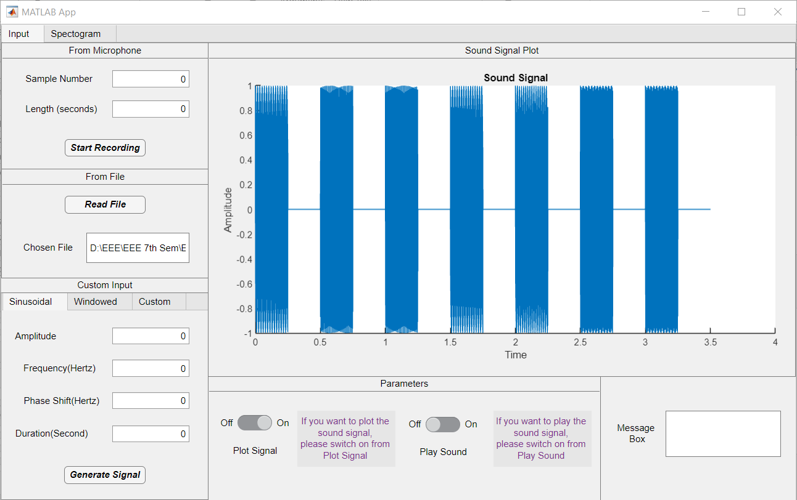
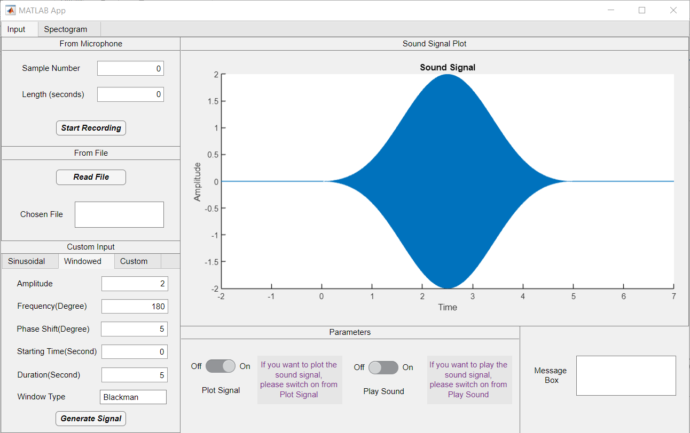
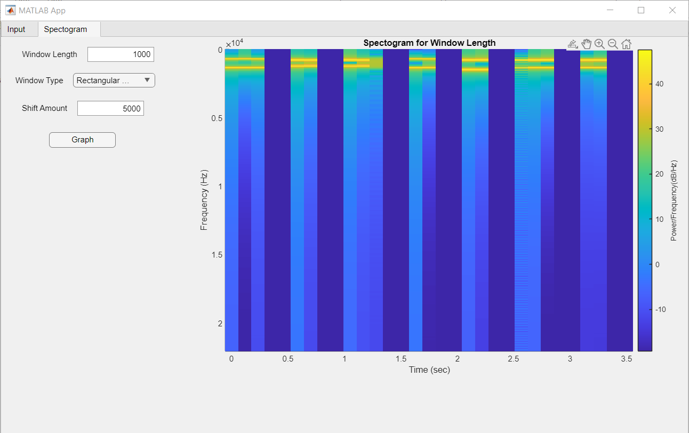

# EE430 Term Project Part 1 Report

## Introduction

In this project, we have developed tools to assess the frequency contents of local parts of a signal. We computed the Short Time Fourier Transform (STFT) and plotted the results on a spectrogram plot. We also studied the effect of different window types on the spectrogram plot and investigated the impacts of changing the window length.

## Interface

The interface aims to implement a computer program that calculates and displays the magnitude of the Short-Time Fourier Transform (STFT) of various input signals. It allows users to record live audio from a connected microphone, process existing audio files, and generate computer-generated data for analysis in the context of digital signal processing.

  

  <em>Figure 1. The GUI</em>

### Properties

The interface includes a private storage area for crucial details such as 'spectogram_window' for spectrogram analysis, 'duration' for recording length, 'time' for time-related data, 'fs' for sampling frequency, and 'signal' for recorded audio.

### Sound Signal Plot and Playing the Record

The switches 'Plot Signal Switch' and 'Play Sound Switch' control the graphing of signal data and the playback of audio, respectively. Users can interactively control these features within the interface.

### Data Input from a Microphone

The 'Start Recording' button activates the recording of sound from a connected microphone. The 'audiorecorder' function is utilized to build an audio recorder object ('recObj'), and the recorded audio signal is retrieved and saved as 'app.signal'.

### Data Input from an Existing File

The 'Read File' button allows users to import existing audio files into the interface. The 'audioread' function retrieves the sampling frequency ('app.fs') and audio signal ('app.signal') from the chosen file.

## Data Generation

Under a tab group, the interface provides three ways to generate time-domain signals: "Sinusoidal," "Windowed," and "Custom."

### Sinusoidal

Users can input settings such as Amplitude, Frequency, Phase Shift, and Duration to generate a sinusoidal signal.

### Windowed

Users can choose window parameters, including duration, start time, amplitude, frequency, phase shift, and window type (Blackman, Triangular, Rectangular) for signal generation.

  

  <em>Figure 2. A Blackman Windowed Signal</em>

### Custom

The 'Custom' tab allows users to generate multiple signals simultaneously with unique properties such as phase shift, frequency, amplitude, starting time, and sampling rate.

## Spectrogram

The interface computes a Short-Time Fourier Transform (STFT) to produce a spectrogram based on the given signal. Users can control parameters such as Shift Amount, Window Type, and Window Length.

The computed spectrogram is displayed using the 'imagesc' function, showing the frequency components of the signal over time in a color-coded form.

  

  <em>Figure 3. A Spectrogram Example</em>

## Conclusion

This project provides a versatile tool for analyzing and evaluating the temporal frequency properties of various signals in the realm of digital signal processing.

*Authors: Ahmet Cankardes, Hasan Hüseyin KARATAS*
