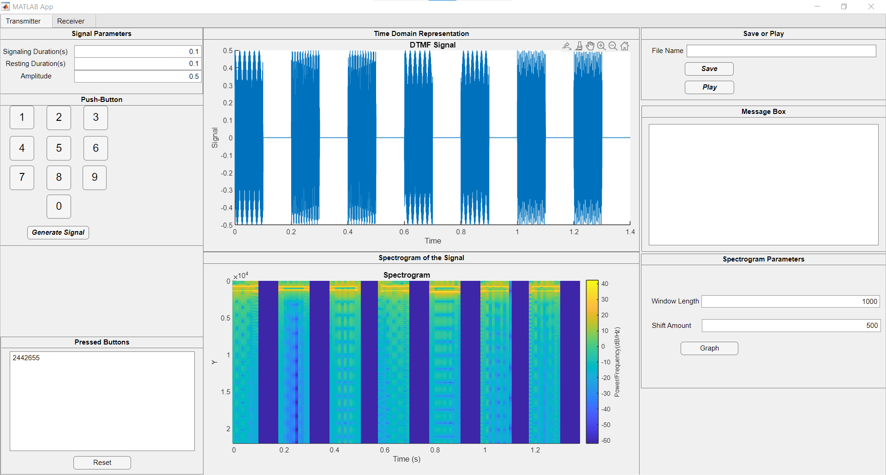
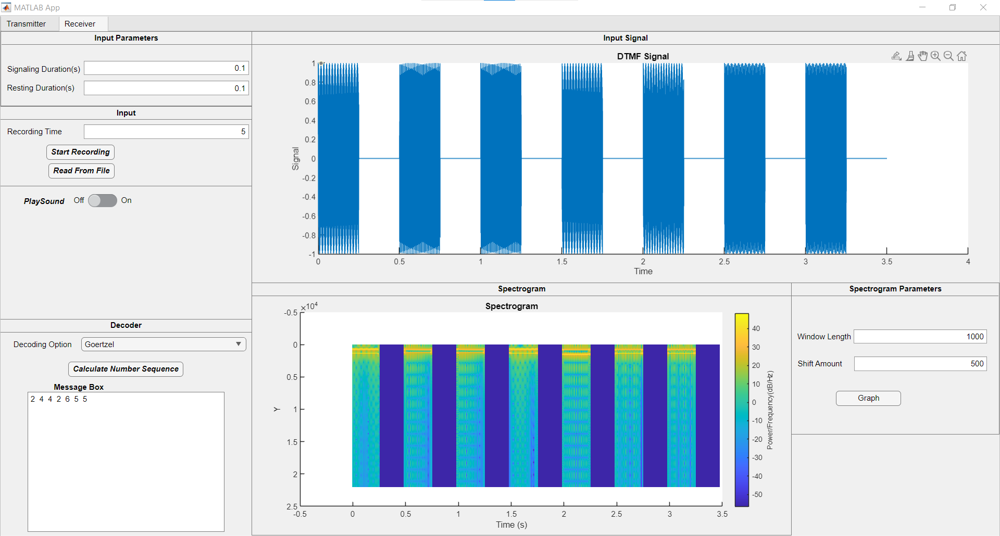

# DTMF Signaling Project - Part 2

## Project Description

In this part of the project, we explore dual-tone multi-frequency (DTMF) signaling. The goal is to implement signal processing methods in MATLAB for generating, transmitting, receiving, and decoding audio DTMF signals. The project involves the creation of a graphical user interface (GUI) using MATLAB's app designer.

  

### 1. Background

Signaling, a fundamental aspect of telecommunication, facilitates the exchange of information between network devices to manage communication sessions. Over the years, various signaling methods have evolved to address the challenges of efficient and reliable communication. In the mid-20th century, the rotary phone emerged as the standard for telephone communications, utilizing pulse dialing to transmit dialed digits to the switching office.

However, the limitations of pulse dialing, characterized by its slow and inefficient nature, prompted the development of the push-button dialing system by AT&T in the 1960s. This innovative system employed Dual-Tone Multi-Frequency (DTMF) signaling, marking a transformative shift in telecommunications. Unlike pulse dialing, where each digit was represented by interruptions in current flow, DTMF signaling encoded each key press with a superposition of two constant frequencies – 4 high and 4 low-frequency groups.

The encoding process involves generating a signal for each key press, with tones corresponding to specific frequencies. As technology progressed, rotary phones gradually gave way to push-button dialing, leveraging the efficiency and versatility of DTMF signaling. In our project, we delve into the intricacies of DTMF signaling, exploring its historical significance and practical applications in modern communication systems.

Understanding the background of signaling sets the stage for our exploration of dual-tone multi-frequency (DTMF) signaling in the subsequent sections. It not only emphasizes the historical context of telecommunication but also underscores the necessity for more efficient signaling methods, ultimately leading to the adoption of DTMF in contemporary communication networks.

### 2. DTMF Encoding

DTMF signaling involves encoding each key using eight tones divided into four high and four low-frequency groups. This encoding is represented by a superposition of two constant frequencies for each key press.

The DTMF-encoded signal can be expressed as:
$s(k)(t; T_d) = (\sin(f_L(k)t) + \sin(f_H(k)t)) \cdot (u(t) - u(t - T_d))$

### 3. Deliverables

### Transmitter Panel

- Push-button keypad
- Display field for pressed keys
- Reset button to clear pressed keys
- Input fields for signaling-duration-per-key $T_d$ and resting duration $T_r$
- Input field to adjust amplitude of time domain signal
- Time domain signal panel to display DTMF-encoded sequence $m(t; T_d, T_r)$
- Display of the spectrogram of generated signal $m(t; T_d, T_r)$
- Save and play buttons for saving and playing the generated signal as audio

  

  <em>Figure 2. Transmitter</em>

### Receiver Panel

- Start/stop listening button
- Display to plot received time domain signal
- Display to plot spectrogram
- Switch to select decoding algorithm
- Display field to show decoded signal

  

  <em>Figure 3. Receiver</em>

### Decoding Methods

#### Spectrogram-Based Method

The Spectrogram-Based decoding method is a signal processing approach used to interpret Dual-Tone Multi-Frequency (DTMF) signals received by the system. In this method, the received audio signal is analyzed by creating a spectrogram, which represents the frequency content of the signal over time. The process involves defining the bandwidth of DTMF tones, creating a matrix of source tones with corresponding symbols, generating a tonemask to identify DTMF tones in the signal, and using FFT (Fast Fourier Transform) to analyze each segment of the signal. The most powerful frequencies in each segment are then mapped to the DTMF matrix, decoding the pressed keys. The decoded symbols are subsequently displayed to the user.

#### Goertzel Algorithm

The Goertzel Algorithm is a digital signal processing technique employed for identifying specific frequency components within a signal. In the context of decoding Dual-Tone Multi-Frequency (DTMF) signals, the Goertzel Algorithm is used to detect individual frequencies corresponding to pressed buttons on a telephone keypad. This algorithm involves preprocessing the incoming signal, analyzing each of the eight DTMF frequencies, thresholding the magnitudes, and decoding the pressed buttons based on the detected frequencies. The Goertzel Algorithm is efficient for real-time processing and is particularly useful in applications where precise frequency detection is required.

For the implementation in our project, we initially found this code from this [GitHub repository](https://github.com/Kartik-Kulgod/DTMF-decoder/blob/master/DTMF_Goertzel.m). However, we observed that this code was not performing well for signals captured from microphone, and our project required real-time processing of signals captured from a microphone. As a result, we devised a modified approach to implement the Goertzel Algorithm, enabling it to seamlessly integrate with our system's requirements. This adaptation enhances the algorithm's versatility, making it applicable to both file-based and real-time scenarios.

In the provided MATLAB code snippet for the Goertzel algorithm, the signal is processed using the Goertzel algorithm. The signal is first filtered using a moving maximum filter to create a tonemask indicating the presence of DTMF tones. Detected tones are then iterated, and for each tone, a segment of the input signal is extracted. The Goertzel algorithm is applied to this segment, decoding the pressed button. The corresponding tone segment is plotted, and the decoded numbers are displayed.

### 4. Conclusion

In conclusion, our journey through this project has been a valuable learning experience, offering insights into the dynamic realm of signal processing and telecommunication. Exploring the nuances of dual-tone multi-frequency (DTMF) signaling has not only deepened our understanding of communication systems but has also provided practical exposure to MATLAB coding and graphical user interface design.

*Authors: Ahmet Cankardes, Hasan Hüseyin KARATAS*  
